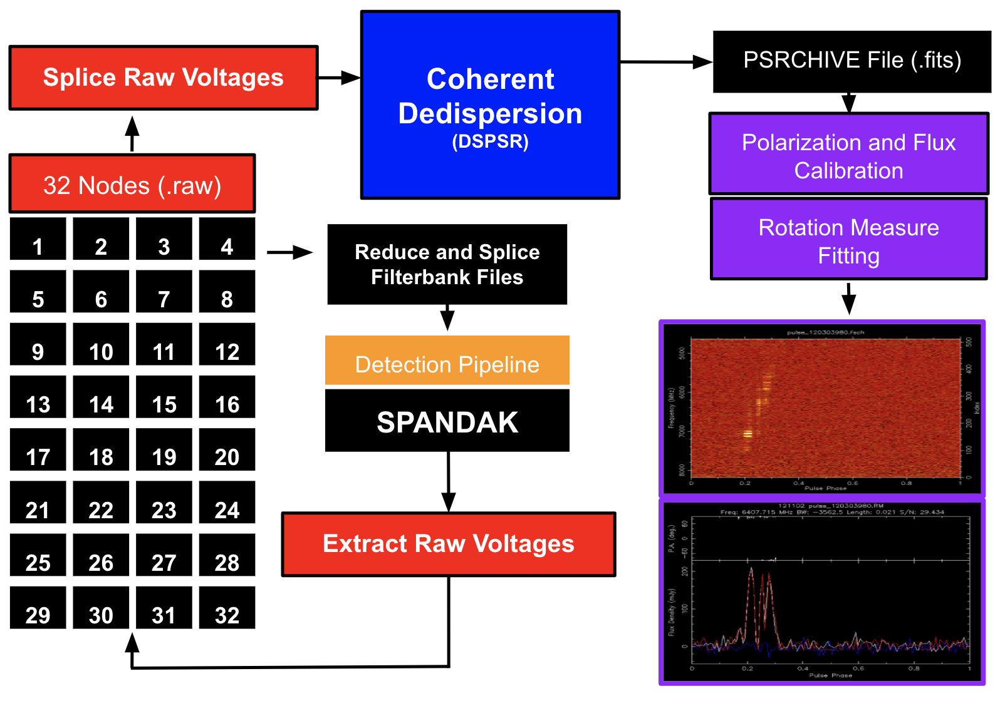

### SPANDAK+
-----------------
The main scripts used in the SPANDAK+ semi-automated pipeline can be found in the SPANDAK+ directory.



The SPANDAK+ is comprised of two components:
> > block

# [[1] Extract2cdd_auto.py](./extract2cdd_auto.py)
-----------------

This first step of the pipeline requires three arguments:<br/>
[1] path to database containing .fil paths and corresponding .raw paths (currently accepts csv)<br/>
[2] path to csv for a single .fil from SPANDAK<br/>
[3] desired grade given by SPANDAK (choose 'B' or 'C')<br/>

First, raw voltages are extracted and place in directories specifying the start and end time of extraction, as well as the band across which they were extracted. This is done using the extract_blocks.py script written by Greg Hell, which can be found in the *extractor* directory. These directories are placed in a surrounding directory labeled 'bursts'. Next, the raw voltages are spliced together using the splicer_raw.py script, also written by Greg Hell and located in the *extractor* directory. Finally, the spliced raw files are coherently dedispersed using DSPSR and place in 'fits' directories within each 'time_band' directory.

**Example Command** 
```
python extract2cdd_auto.py /datax/scratch/jfaber/SPANDAK_extension/database.csv /datax/scratch/jfaber/SPANDAK_extension/57991_49905_DIAG_FRB121102_0011.csv B
```

# [[2] Polfluxrm_auto.py](./polfluxrm_auto.py)
-----------------
Once step 1 is complete, the second step can be initiated, and requires two arguments:<br/>
[1] path to directory containing fits files<br/>
[2] path to directory containing calibration files for the observation<br/>

Currently, step two is only run on individaul bursts—--this will be generalized in the future. The fits files are first converted to and stored as numpy arrays and pngs in case the pulse needs to be visually verified. The, using the calibration files, polarization and flux calibration are performed, followed by fitting of the rotation measure with the script RMfit_curve.py written by Vishal Gajjar. The RM fit results are output as a csv file '[pulse_id].calib.rmfit.csv', and the PA value, including error is printed in the terminal.

**Example Command** 
```
python polfluxrm_auto.py /datax/scratch/jfaber/SPANDAK_extension/bursts/26.2_26.6_3.8_9/fits /datax/scratch/jfaber/SPANDAK_extension/calib_files
```
### Intensity Analysis

This branch of the pipeline is geared towards analyzing intensity data using numpy arrays that have been generated by PSRCHIVE. Utilities include:<br/>
[1] Drift Rate Calculation<br/>
[2] Scattering Tail Analysis<br/>
[3] Sub-burst and Centroid Identificaiton<br/>
[4] Instrumental Artifact Flagging<br/>
[5] Fourier Spectrogram Analysis<br/>

More on these utitlies can be found in:  

